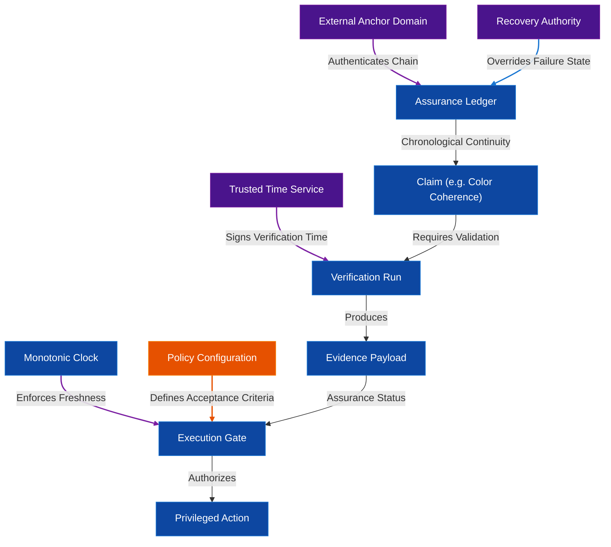

# ARCH-TRUST-001 — Trust, Authority & Epistemic Architecture Consolidation

**Status:** ENGINEERING REVIEW COMPLETE — CORRECTIONS APPLIED  
**Architectural Ratification:** PENDING  
**Phase:** Consolidation (Consolidating RTC-008 through RTC-012)  
**Priority:** CRITICAL  
**Date:** 2026-08-28  

---

## 1. Executive Architecture Summary

This document represents the canonical consolidation of the trust, authority, and epistemic boundaries established during the experimental validation cycle (RTC-008 through RTC-012). The primary objective of this architecture is to transition the Visual Intelligence engine from an unconstrained prototype to a trust-gated, deterministic runtime. 

By separating intelligence execution from verification authority, implementing out-of-band trust anchoring, and establishing formal temporal and recovery models, the architecture guarantees that no critical or privileged action (e.g., release, deployment, or key changes) can occur without verified, fresh, and tamper-resistant evidence. If any component of the security substrate is compromised, the system is guaranteed to degrade to a secure, locked-out state (`RECOVERY_REQUIRED` / `BLOCKED`) rather than manufacturing false certainty.

---

## 2. Trust Domains

We partition the system into eight distinct Trust Domains to enforce privilege separation and prevent horizontal privilege escalation.

### 2.1. Local Intelligence Domain
*   **Responsibility:** Generates design concepts, asset compilations, metadata, and handles primary workflow execution.
*   **Trusted Inputs:** Developer guidelines, local configuration files, and campaign parameters.
*   **Produced Outputs:** Claims (`Claim` objects), generated assets, and initial state descriptions.
*   **Authority Possessed:** Proposing claims, generating creative assets, and requesting authorization for downstream actions.
*   **Authority NOT Possessed:** Certifying its own claims, modifying verification policies, bypassing execution gates, or unilaterally declaring a claim `VERIFIED`.
*   **Trust Assumptions:** Assumed to be potentially buggy or compromised (e.g., subject to prompt injection or model drift).
*   **Failure State:** Produces faulty claims or out-of-spec assets.
*   **Compromise Impact:** High-level generation errors, prompt leakage, or drift in creative output, but blocked from modifying security configuration or executing unauthorized code.

### 2.2. Verification Domain
*   **Responsibility:** Orchestrates verification runs (`ExperimentRun`), executes verifiers, and produces proof digests.
*   **Trusted Inputs:** Claims, proof obligations, raw execution parameters, and trusted time payloads.
*   **Produced Outputs:** Provenance-bound `Evidence` payloads with cryptographic content digests.
*   **Authority Possessed:** Evaluating correctness metrics, calculating content digests, and declaring verification results (`SATISFIED` / `UNSATISFIED`).
*   **Authority NOT Possessed:** Modifying execution gate policies, editing the historical ledger, or executing recovery procedures.
*   **Trust Assumptions:** Harness logic is correct; verifier binaries are authentic.
*   **Failure State:** Returns false passes/fails or crashes.
*   **Compromise Impact:** Attacker can forge verification results for current runs, but cannot rewrite past ledger entries or alter external trust anchors.

### 2.3. Assurance Domain
*   **Responsibility:** Tracks claim dimensions, constructs the `AssuranceGraph`, propagates invalidations (e.g., when counterexamples are discovered), and computes overall decisions.
*   **Trusted Inputs:** Claims, proof obligations, evidence references, and counterexamples.
*   **Produced Outputs:** Multidimensional status matrices and propagation events.
*   **Authority Possessed:** Updating decision states, invalidating claims based on telemetry, and managing the in-memory graph.
*   **Authority NOT Possessed:** Direct execution of system tasks, modifying external trust anchors, or overriding recovery states.
*   **Trust Assumptions:** Graph library executes correctly and states are updated sequentially.
*   **Failure State:** Indeterminate claim states, failed propagation, or memory exhaustion.
*   **Compromise Impact:** Gating decisions may become stale or incorrect, but cannot alter the persistent ledger.

### 2.4. Execution / Enforcement Domain
*   **Responsibility:** Enforces system gating for privileged actions (compile, release, deploy, security change) using the `ExecutionGate`.
*   **Trusted Inputs:** Active epistemic state decision matrix from the Assurance Domain and freshness tokens.
*   **Produced Outputs:** Gating enforcement (Pass / Fail-Closed Block).
*   **Authority Possessed:** Enforcement of active authorization decisions. `ExecutionGate` is strictly an **enforcement mechanism**, not an authority that defines policy or makes decisions.
*   **Authority NOT Possessed:** Defining policy, making authorization decisions, modifying claims, generating evidence, or performing recovery overrides.
*   **Trust Assumptions:** Hardcoded fail-closed enforcement logic executes correctly without transient state bypasses.
*   **Failure State:** Unintended blocking (fail-closed) or enforcement bypass (fail-open).
*   **Compromise Impact:** If fail-open, unauthorized deployments can occur.
*   **Mitigation:** Absolute fail-closed logic is hardcoded (UNKNOWN state is blocked).

### 2.5. Monitoring Domain
*   **Responsibility:** Continuously ingests telemetry events, monitors runtime drift, and registers counterexamples.
*   **Trusted Inputs:** System telemetry streams, asset generation logs, and drift ratios.
*   **Produced Outputs:** `Counterexample` objects and invalidation events.
*   **Authority Possessed:** Initiating claim invalidation and recording counterexamples to the persistent ledger.
*   **Authority NOT Possessed:** Overriding verifications, authorizing actions, or rotating recovery keys.
*   **Trust Assumptions:** Telemetry logs are delivered reliably and reflect ground-truth execution.
*   **Failure State:** Missed drift anomalies or false-positive alarms.
*   **Compromise Impact:** Attacker could suppress alarms (failing to invalidate a compromised claim), but cannot override active blocks.

### 2.6. External Trust-Anchor Domain
*   **Responsibility:** Decoupled secure service tracking chain metadata (genesis hash, block count, latest block hash) out-of-band.
*   **Trusted Inputs:** Registrar requests from the local controller during authorized state changes.
*   **Produced Outputs:** Verification status of the chain history (Boolean / exceptions).
*   **Authority Possessed:** Validating ledger continuity, detecting ledger rollbacks, and rejecting replacement histories.
*   **Authority NOT Possessed:** Modifying local database content or executing recovery overrides.
*   **Trust Assumptions:** Isolated process boundary is secure and unaffected by local OS filesystem compromise.
*   **Failure State:** Service unavailable (triggers fail-safe degradation locally).
*   **Compromise Impact:** If compromised, attacker can hide local ledger modifications, but cannot forge admin signatures.

### 2.7. Temporal Authority Domain
*   **Responsibility:** Mock/independent NTP clock (`TrustedTimeService`) that supplies signed time responses with nonces.
*   **Trusted Inputs:** Nonce parameters generated dynamically by the local controller.
*   **Produced Outputs:** Signed trusted time payloads (`{"timestamp": t, "nonce": n, "signature": s}`).
*   **Authority Possessed:** Establishing network time reference assertions.
*   **Authority NOT Possessed:** Modifying policy boundaries, establishing absolute trusted historical timelines, or changing claim states.
*   **Trust Assumptions:** Network communication is secure; signing key remains secret.
*   **Failure State:** Time drift, network partition, or signature failure.
*   **Compromise Impact:** Replay of historical time or time jumps (mitigated by local monotonic checks).

### 2.8. Recovery Authority Domain
*   **Responsibility:** Safe transition of the system from `RECOVERY_REQUIRED` to `NORMAL` state.
*   **Trusted Inputs:** Admin public keys and override signature strings.
*   **Produced Outputs:** Authorized state reset commands.
*   **Authority Possessed:** Wiping corrupted histories, resetting ledger genesis, and restoring system status.
*   **Authority NOT Possessed:** Continuous workflow validation or policy adjustments.
*   **Trust Assumptions:** Admin private keys are kept offline and secure.
*   **Failure State:** Unavailability of admin key or unauthorized signature generation.
*   **Compromise Impact:** Total system compromise; attacker can force state resets and wipe history.

---

## 3. Authority Hierarchy & Explicit Separation of Roles

The authority hierarchy defines the explicit boundaries of who defines policies, who decides authorizations, and who enforces decisions. The system enforces strict separation of duties:

```text
WHO DEFINES THE POLICY?  ──>  Offline Administrative Keys / Security Policy Configuration
WHO MAKES THE DECISION?  ──>  Assurance Domain (AssuranceLoopController state computation)
WHO ENFORCES DECISION?   ──>  Execution Gate (ExecutionGate fail-closed enforcement)
```

```text
                                [Administrator] (Off-line Policy Key)
                                       ↓
                           [Recovery Authority Domain]
                                       ↓
 [Verification Domain]      [Assurance Domain Graph]      [Monitoring Domain]
         ↓                             ↓                            ↓
 (Produces Evidence)           (Decides Authorization)    (Produces Counterexamples)
         ↳                             ↓                            ↵
                           [Execution Enforcement Gate]
                                       ↓
                           (Enforces Gate Decision)
```

### 3.1. Authority Permissions Matrix

| Operation | Local Intelligence | Verification Domain | Assurance Domain | Execution Gate | Recovery Authority |
|---|---|---|---|---|---|
| **Generate Claim** | Allowed (Propose) | Denied | Denied | Denied | Denied |
| **Verify Claim** | Denied | Allowed | Denied | Denied | Denied |
| **Produce Evidence** | Denied | Allowed | Denied | Denied | Denied |
| **Assign Assurance** | Denied | Denied | Allowed | Denied | Denied |
| **Authorize Decision**| Denied | Denied | Allowed (Decides) | Denied | Denied |
| **Enforce Gate** | Denied | Denied | Denied | Allowed (Enforces) | Denied |
| **Revoke Assurance** | Denied | Denied | Allowed | Denied | Denied |
| **Trigger Recovery** | Denied | Denied | Allowed | Denied | Allowed |
| **Authorize Recovery** | Denied | Denied | Denied | Denied | Allowed |
| **Modify Verification Policy**| Denied | Denied | Denied | Denied | Allowed (via Admin) |
| **Modify Trust Anchors**| Denied | Denied | Denied | Denied | Allowed (via Admin) |
| **Modify Recovery Authority**| Denied | Denied | Denied | Denied | Allowed (via Rotation) |
| **Modify Intelligence Code**| Denied | Denied | Denied | Denied | Allowed (via Admin) |

### 3.2. Separation Constraints
*   **No Self-Certification:** The Local Intelligence Domain is untrusted and cannot verify its own claims. All claims must be evaluated by the isolated Verification Domain.
*   **Enforcement vs. Decision:** `ExecutionGate` must not be described as the ultimate authority. It merely enforces the decisions computed by the `AssuranceDomain`.
*   **No Ledger Overwrite:** Local runtime states cannot rewrite past ledger database entries. Only chronological append operations are permitted.
*   **No Autonomous Override:** If a validation error is detected, the system degrades to `RECOVERY_REQUIRED` and blocks. The local runtime cannot transition back to `NORMAL` without an external cryptographic signature provided by the Recovery Authority.


---

## 4. Epistemic State Model

The system operates under a formalized Epistemic State Model to represent the degree of confidence in any given claim. 

```text
       +------------------------------------+
       |              UNKNOWN               | <----+ (Degraded State / Post-Recovery Reset)
       +------------------------------------+      |
         | (Initialize)             |              | (Telemetry Offline /
         v                          |              v  Assurance Revoked)
       +--------------------+       |       +-----------------------+
       |     UNVERIFIED     |       |-----> | REASSESSMENT_REQUIRED |
       +--------------------+       |       +-----------------------+
         |                          |              ^
         | (Run Verification)       | (Anomaly)    | (Stale / Counterexample)
         v                          v              |
       +--------------------+     +-----------------------+
       |   VERIFIED (Gate)  |---> |         STALE         |
       +--------------------+     +-----------------------+
         |                          |
         | (Drift / Verification    | (Failed Rollback /
         |  Failure / Anomaly)      |  Tamper Detected)
         v                          v
       +------------------------------------+
       |          RECOVERY_REQUIRED         |
       +------------------------------------+
         |                        |
         | (Admin Override        | (Recovery Failed /
         |  Verified: Wipes DB)   |  Key Missing)
         v                        v
       +--------------------+   +------------------------------------+
       |      UNKNOWN       |   |              BLOCKED               |
       +--------------------+   +------------------------------------+
                                  |
                                  | (Cold-Boot Manual DB Reset)
                                  v
                                +--------------------+
                                |      UNKNOWN       |
                                +--------------------+
```

### 4.1. State Definition details

#### 4.1.1. UNKNOWN
*   **Meaning:** Default fallback, degraded, or post-recovery-reset state. Represents complete lack of evidence.
*   **Entry Evidence:** System initialization, telemetry loss, unknown failure, or valid post-recovery database wipe/reset.
*   **Exit Conditions:** Successful claim registration transitions it to `UNVERIFIED`.
*   **Permitted Actions:** Read-only system introspection, telemetry parsing.
*   **Prohibited Actions:** No privileged releases, compiles, deployments, or security policy changes.

#### 4.1.2. UNVERIFIED
*   **Meaning:** Claim is formally registered but no verification runs have been processed.
*   **Entry Evidence:** Claim registration payload inserted into the Assurance Graph.
*   **Exit Conditions:** Verification run completion.
*   **Permitted Actions:** Queuing verifier runs, compiling test builds.
*   **Prohibited Actions:** Code release, production deployment, or security modifications.

#### 4.1.3. VERIFIED
*   **Meaning:** Bounded claims are verified, evidence is valid, freshness is active, and no counterexamples exist.
*   **Entry Evidence:** `verify_primary() == True`, cryptographic signature check on evidence, freshness checks pass.
*   **Exit Conditions:** Timeout (monotonic or wall-clock), counterexample discovery, or telemetry monitor disconnect.
*   **Permitted Actions:** Release compilation, production deployment, and security change gating.
*   **Prohibited Actions:** Self-modification of verification parameters.

#### 4.1.4. STALE
*   **Meaning:** Freshness deadline has elapsed.
*   **Entry Evidence:** `time.monotonic() > monotonic_freshness_deadline` or `time.time() > freshness_deadline`.
*   **Exit Conditions:** Execution of a new successful verification run.
*   **Permitted Actions:** Querying system metrics, triggering a new verification run.
*   **Prohibited Actions:** Deployments, releases, or security changes.

#### 4.1.5. REASSESSMENT_REQUIRED
*   **Meaning:** A non-fatal anomaly (e.g., wall-clock jump or transient verification failure) has occurred.
*   **Entry Evidence:** Verification failure or clock jump > 3600s.
*   **Exit Conditions:** Successful verifier execution and new evidence payload ingestion.
*   **Permitted Actions:** Sandbox testing, diagnostic log outputs.
*   **Prohibited Actions:** Privileged actions are entirely gated.

#### 4.1.6. RECOVERY_REQUIRED
*   **Meaning:** Severe security or structural compromise detected (e.g., hash chain broken, block count rolled back).
*   **Entry Evidence:** LedgerTamperError, RollbackAttackError, or ChainReplacementError.
*   **Exit Conditions:** Valid admin override signature matching the current Incident UUID (transitions to `UNKNOWN`), or recovery failure/timeout (transitions to `BLOCKED`).
*   **Permitted Actions:** Outputting diagnostic telemetry and the unique incident UUID.
*   **Prohibited Actions:** All normal workflows, claims processing, and deployments are completely blocked.

#### 4.1.7. BLOCKED
*   **Meaning:** Persistent safety lock state after repeated recovery failures, invalid signatures, or when Recovery Authority is offline.
*   **Entry Evidence:** Persistent initialization failure, recovery verification failure, or missing recovery keys.
*   **Exit Conditions:** Manual cold-boot configuration wipe and physical database reset (transitions state back to `UNKNOWN`).
*   **Permitted Actions:** Introspection log retrieval.
*   **Prohibited Actions:** All local execution gates lock privileged actions. `BLOCKED` can NEVER directly authorize privileged execution.

#### 4.1.8. Tripartite Distinction: Recovery Authorization vs. Runtime Authorization vs. Enforcement
The architecture maintains a strict distinction across three separate domains:
1.  **Recovery Authorization:** Authorized out-of-band by offline Admin Keys. A verified recovery override authorizes **ONLY** wiping corrupted database history, resetting the genesis block, and transitioning state from `RECOVERY_REQUIRED` to `UNKNOWN`. It grants **ZERO** runtime execution permissions and does **NOT** transition any claim to `VERIFIED`.
2.  **Runtime Authorization:** Computed autonomously by the `Assurance Domain` based strictly on fresh, provenance-bound evidence produced by the isolated `Verification Domain`. Only fresh verification runs can transition a claim from `UNKNOWN` $\to$ `UNVERIFIED` $\to$ `VERIFIED`.
3.  **Enforcement:** Executed by `ExecutionGate`, which strictly locks all privileged operations whenever the active epistemic state is anything other than `VERIFIED`.## 5. Epistemic Definition of "VERIFIED" & Evidence vs. Truth

In this architecture, `VERIFIED` is **never** simplified to a binary boolean flag (e.g., `test_passed = true`) nor is it treated as a statement of objective reality. 

### 5.1 Epistemic Definition
`VERIFIED` is defined as a bounded epistemic assessment:
> **Evidence currently satisfies the defined verification conditions within the declared scope, policy, and trust assumptions.**

It requires satisfaction of ten distinct parameters:
1.  **Verification Result:** The primary verification algorithm evaluates to `True` under defined test parameters.
2.  **Evidence Authenticity:** An authentic `Evidence` record exists with a matching SHA-256 payload digest.
3.  **Freshness Deadline:** System monotonic time remains within the active freshness deadline (`monotonic_verified_at + 2.0s`).
4.  **Declared Scope:** Verification occurred within declared scope boundaries (e.g., `sandbox-env`).
5.  **Execution Independence:** Verification executed in an isolated domain separate from claim proposal.
6.  **Absence of Counterexamples:** No active counterexamples exist for the target claim.
7.  **Policy Alignment:** Acceptance criteria match current security policy definitions.
8.  **Initialization Authority:** Claim was initialized by an authorized entity.
9.  **Temporal Assertion:** Signed time payload with valid nonce matching.
10. **Provenance Metadata:** Full provenance metadata (verifier version, seed, environment) is cryptographically bound to the evidence.

### 5.2 Evidence vs. Truth Distinction
The architecture strictly enforces the distinction between evidence validity and objective truth:
```text
cryptographic authenticity  ≠  objective truth
valid provenance            ≠  objective truth
signed evidence             ≠  true proposition
```
A valid cryptographic signature proves only that a key signed specific data; it does not establish that the proposition represented by that data is objectively true.

---

## 6. Evidence Provenance Model

Consequential evidence generated by verification runs must contain structured metadata to trace its origin and ensure integrity.

### 6.1. Minimum Provenance Metadata Scheme
```json
{
  "evidence_id": "EV-1784583612000",
  "type": "DIRECT",
  "run_ref": "RUN-1784583612000",
  "content": {
    "test_drift_ratio": 0.05,
    "status": "PASS"
  },
  "created_at": 1784583612.0,
  "verifier_version": "1.0.0",
  "judge_version": "1.0.0",
  "policy_version": "1.0.0",
  "environment_ref": "sandbox-env",
  "configuration": {
    "global_threshold_config": 0.10
  },
  "seed": 42,
  "content_digest": "7a83d4...",
  "integrity_status": "VALID",
  "freshness_status": "CURRENT"
}
```

### 6.2. Evidence Lifespans
*   **Valid:** Cryptographic digest matches recalculated value, and freshness deadline is not exceeded.
*   **Stale:** Elapsed monotonic time exceeds the freshness deadline. The evidence remains structurally valid but cannot authorize gates.
*   **Out-of-Scope:** Software changes (target version mismatch) or environment changes render the evidence irrelevant.
*   **Superseded:** A newer verification run on the same claim writes a newer block to the ledger, superseding old evidence.
*   **Contradicted:** Telemetry ingests a verified drift ratio $> 10\%$, creating a `Counterexample` that contradicts the active evidence.
*   **Unverifiable:** The content digest mismatch occurs, marking the evidence `COMPROMISED`.

---

## 7. Temporal Semantics & Clock Boundaries

Temporal manipulation is a major attack vector in local runtime systems. We explicitly differentiate four temporal mechanisms and their bounded properties:

```text
+-------------------------+  +-------------------+  +--------------------------+  +-------------------------+
|     Wall-Clock Time     |  |  Monotonic Time   |  |   Logical Event Order    |  |  Signed External Time   |
+-------------------------+  +-------------------+  +--------------------------+  +-------------------------+
| - Human-readable logs   |  | - Elapsed duration|  | - Sequence counter       |  | - Signed time payload   |
| - Audit trail display   |  | - Timeout checks  |  | - Causal event ordering  |  | - Nonce-checked NTP     |
| - Reboot rollback check |  | - TOCTOU gating   |  | - Replay protection      |  | - External time assertion|
+-------------------------+  +-------------------+  +--------------------------+  +-------------------------+
```

### 7.1 Bounds on Time Source Assertions
*   **Monotonic Elapsed Time (`time.monotonic()`):** Establishes elapsed duration and ordering without establishing trusted absolute time or trusted historical chronology.
*   **Logical Event Order:** Establishes causal event sequence without establishing physical time duration.
*   **Signed External Time (`TrustedTimeService`):** Establishes an external signed time assertion bound to a dynamic nonce. It does **not** establish an absolute trusted historical timeline, as NTP feeds remain vulnerable to key compromise or upstream relay manipulation.

---

## 8. Trust-Anchor Semantics

The assurance ledger's security is guaranteed by anchoring its state to both local and external verification endpoints. 

### 8.1. Trust Security Mechanisms

*   **Local Consistency:** SQLite database transactions are atomic. We read local state and verify each hash.
*   **Ledger Integrity:** Cryptographic hashing of payloads (`hash = SHA-256(content + prev_hash)`). Tampered records break downstream verification.
*   **Ledger Continuity:** The ledger enforces sequence continuity. Inserting or deleting rows invalidates the chain because the hash chaining links consecutive hashes.
*   **Ledger Authenticity:** During validation, the local controller queries the decoupled `ExternalTrustAnchorService` to verify that the local genesis hash matches the registered genesis hash.
*   **Ledger Freshness:** The ledger block count must match the count registered on the external trust anchor. This prevents attackers from rolling back the local database to a previous clean state.
*   **Ledger Durability:** Persistence is managed via standard SQLite transactional journals.
*   **Non-Repudiation:** Cryptographic audit trail. *Note: As established in RTC-012, absolute non-repudiation is NOT achieved due to the potential for administrative credentials override.*

### 8.2. Anchor Threat Model

| Anchor Property | Verification Mechanism | Trusted Component | Threat Model | Remaining Assumptions |
|---|---|---|---|---|
| **Genesis Integrity** | Registry check | External Trust Anchor | Alternate chain swap | Anchor registry is uncompromised |
| **Chronological Continuity** | Count matching | External Trust Anchor | Truncation / Rollback | DB and Anchor count match |
| **NTP Authenticity** | Signature/Nonce check | TrustedTimeService | Network MITM / NTP spoof | NTP private key remains secret |
| **Recovery Override** | Cryptographic signature | Admin keys | Override replay / Forgery | Admin override keys offline |

---

## 9. Recovery-Authority Model

`RECOVERY_REQUIRED` is treated as a formal epistemic state rather than a transient error block. The recovery system uses a secure cryptographic challenge-response protocol.

### 9.1. Secure Challenge-Response Protocol
1.  **State Degradation:** Upon detecting a verification, temporal, or trust-anchor anomaly, the system transitions to `RECOVERY_REQUIRED` and generates a unique, single-use `incident_uuid` based on the hash of the error details.
2.  **Challenge Generation:** The controller publishes the challenge string, which is scoped by:
    $$\text{Expected Signature} = \text{override\_signature\_} + \text{incident\_uuid} + \text{\_} + \text{genesis\_hash} + \text{\_} + \text{block\_count} + \text{\_} + \text{admin\_public\_key}$$
3.  **Authentication:** The administrator signs the challenge out-of-band using their offline private key.
4.  **Verification & State Reset:** The controller validates the signature against the registered `authorized_admin_keys`. If it matches, the corrupted database and anchors are wiped and re-initialized, returning the system state to `UNKNOWN`. This Recovery Authorization clears the panic lock but grants **ZERO** runtime authorization; fresh verification runs must be executed independently by the Verification Domain to evaluate claims and transition them to `VERIFIED`.

### 9.2. Security Invariants
*   **Replay Prevention:** The signature is bound to the `incident_uuid` and current database state metrics. A signature from a past incident cannot be replayed.
*   **Rotation:** Recovery credentials can be rotated via `rotate_admin_key()`, which invalidates the old key immediately upon success.
*   **Unavailability:** If the recovery authority is offline or keys are missing, the system remains in `RECOVERY_REQUIRED` and blocks execution indefinitely.

---

## 10. Failure Semantics

Components are designed to fail-closed when integrity compromises or service outages occur.

```text
+------------------------------+     +-----------------------+     +--------------------------+
|      Component Failure       | ==> |   Epistemic State     | ==> |  Execution Consequence   |
+------------------------------+     +-----------------------+     +--------------------------+
| Ledger Corruption            |     | RECOVERY_REQUIRED     |     | ALL privileged gates locked|
| External Anchor Unavailable      |     | RECOVERY_REQUIRED     |     | ALL privileged gates locked|
| NTP Time Source Offline      |     | RECOVERY_REQUIRED     |     | ALL privileged gates locked|
| Clock Rollback Detected      |     | STALE                 |     | Gated actions blocked    |
| Clock Jump Detected          |     | REASSESSMENT_REQUIRED |     | Re-verification required |
| Counterexample Confirmed     |     | REFUTED               |     | Gated actions blocked    |
+------------------------------+     +-----------------------+     +--------------------------+
```

### 10.1. Specific Failure Handlers

*   **Local Ledger Corruption:** A `LedgerTamperError` is raised. The controller halts process initialization, drops the state to `RECOVERY_REQUIRED`, generates an incident UUID, and blocks the execution gate.
*   **External Anchor Unavailable:** Raises `ServiceUnavailableError`. System degrades to `RECOVERY_REQUIRED` to prevent running in an unanchored state.
*   **External Anchor Disagreement:** Raises `RollbackAttackError` or `ChainReplacementError`. State drops to `RECOVERY_REQUIRED` and requires admin override.
*   **Trusted Time Unavailable:** Raises `ServiceUnavailableError`. Freshness cannot be validated, transiting claims to `RECOVERY_REQUIRED`.
*   **Trusted Time Disagreement (Rollback):** Raises `ValueError` during verification. Claim freshness is marked `STALE`, transiting overall status to `REASSESSMENT_REQUIRED`.
*   **Recovery Authority Unavailable:** Wiping or re-initializing the ledger is blocked. The execution gate remains locked.
*   **Invalid Recovery Signature:** The recovery attempt is rejected. The system remains in `RECOVERY_REQUIRED`.
*   **Evidence Corruption:** Recalculating hash fails. The claim evidence status is set to `COMPROMISED`, resetting the overall claim decision to `REASSESSMENT_REQUIRED`.
*   **Stale Evidence:** Monotonic timeout triggers. The claim freshness status changes to `STALE`, blocking the gate.
*   **Verifier Disagreement:** If primary verification fails, the claim status transitions to `UNSATISFIED`, blocking deployment.

---

## 11. Root-of-Trust Boundaries & Declared Assumptions

A secure architecture must document its root-of-trust boundaries as **declared architectural assumptions** (`ASSUMED`) rather than proven trust roots.

### 11.1. Declared Architectural Trust Assumptions

1.  **Administrative Keys (`ASSUMED`):**
    *   *Assumption:* The architecture assumes the integrity of offline admin keys stored in HSMs.
    *   *Boundary:* Guarantees stop if offline admin credentials are physically compromised.
2.  **External Anchor Registry (`ASSUMED`):**
    *   *Assumption:* The architecture assumes process/container isolation of the `ExternalTrustAnchorService`.
    *   *Boundary:* Guarantees stop if host kernel isolation fails.
3.  **Trusted Time Signing Key (`ASSUMED`):**
    *   *Assumption:* The architecture assumes the NTP provider's signing key remains uncompromised.
    *   *Boundary:* Guarantees stop if the NTP private key is leaked.
4.  **Host OS & Monotonic Clock (`ASSUMED`):**
    *   *Assumption:* The architecture assumes CPU hardware and kernel-level monotonic timers operate correctly.
    *   *Boundary:* Guarantees stop at kernel-level compromise or hardware side-channel manipulation.

If all trust anchors or keys are compromised, the system has no remaining trustworthy authority. In this state, the system degrades to `UNKNOWN` or `BLOCKED` rather than manufacturing false certainty.

---

## 12. Trust Dependency Graph

The following diagram maps the flow of trust and dependencies from the underlying anchors to the final privileged system action.



*   **Edges:**
    *   `External Anchor → Assurance Ledger`: Externally anchored.
    *   `Trusted Time Service → Verification Run`: Externally anchored.
    *   `Monotonic Clock → Execution Gate`: Locally derived.
    *   `Recovery Authority → Assurance Ledger`: Externally anchored.
    *   `Policy Configuration → Execution Gate`: Assumed.
    *   `Assurance Ledger → Claim`: Independently verified.
    *   `Claim → Verification Run`: Locally derived.
    *   `Verification Run → Evidence Payload`: Independently verified.
    *   `Evidence Payload → Execution Gate`: Independently verified.
    *   `Execution Gate → Privileged Action`: Trusted (fail-closed gating).

---

## 13. Circular-Trust Analysis

We analyze the design to identify and eliminate circular dependencies where a component validates itself.

### 13.1. Identified Circular Dependencies
1.  **Verifier validation:** A verifier validating its own binary authenticity.
    *   *Resolution:* Binary verification must occur out-of-band at the OS container layer using cryptographically signed image digests.
2.  **Authority validation:** The local controller validating its own recovery authorization.
    *   *Resolution:* Wiping and recovery re-initialization requires external signatures from the Recovery Authority. The controller only verifies the signature format against a preloaded key.
3.  **Local configuration definition:** Local `config.json` defining the trust root for database verification.
    *   *Resolution:* Decoupled external trust anchors (`ExternalTrustAnchorService`) maintain the genesis and latest block hash independently of the local filesystem.
4.  **Self-certification:** The Intelligence Agent certifying its own generated output.
    *   *Resolution:* Explicitly decoupled Verification and Monitoring domains execute tests on generated assets. The intelligence agent has no interface to register evidence.

---

## 14. Architecture Invariants

We define eight core invariants that must be preserved by the architecture at all times.

*   **I-001: Unknown cannot silently authorize privileged action.**
    *   *Status:* VALIDATED (Test 19, execution gate blocks when state is UNKNOWN).
*   **I-002: A component cannot unilaterally certify its own authority.**
    *   *Status:* VALIDATED (The local controller cannot override `RECOVERY_REQUIRED` without external admin signatures).
*   **I-003: Evidence must remain provenance-bound.**
    *   *Status:* VALIDATED (Evidence payloads contain target version, seed, environment, and verifier version metadata bound to the hash digest).
*   **I-004: Counterexamples cannot be silently erased by positive evidence.**
    *   *Status:* VALIDATED (If counterexample status is `CONFIRMED`, `overall_decision` is forced to `REASSESSMENT_REQUIRED` even if verification passes).
*   **I-005: Stale assurance cannot silently become current.**
    *   *Status:* VALIDATED (Monotonic freshness expiration blocks the gate even if wall-clock checks are bypassed).
*   **I-006: Recovery cannot be authorized by the compromised subject alone.**
    *   *Status:* VALIDATED (Local process cannot bypass recovery mode without validating the external signature).
*   **I-007: Historical evidence cannot be silently rewritten by newer verifiers.**
    *   *Status:* VALIDATED (The ledger's hash chaining prevents retroactive rewrite of evidence database records).
*   **I-008: Trust-anchor compromise cannot silently become trusted state.**
    *   *Status:* VALIDATED (Mismatch between local and external anchor block metrics throws a `RollbackAttackError` or `ChainReplacementError`).

---

## 15. Evidence Classification

Architectural statements and claims are classified according to experimental evidence:

1.  **OBSERVED:** SQLite transaction latency, local file integrity checks.
2.  **EXPERIMENTALLY DEMONSTRATED:** Local clock rollback immunity (Test 9), Ledger rewrite detection (Test 12), complete chain replacement detection (Test 13), recovery override (Test 14), and key rotation (Test 15).
3.  **IMPLEMENTED BUT UNPROVEN:** Distributed multi-process monotonic sync (currently simulated via local monotonic ticks).
4.  **ASSUMED:** The security of the NTP provider signing keys and HSM containment of administrative recovery keys.
5.  **PROPOSED:** Decentralized consensus trust anchoring (replacing the single external anchor service).
6.  **UNKNOWN:** Behavior under coordinated hardware side-channel attacks on the CPU's monotonic timer.
7.  **REFUTED:** The claim that monotonic time alone establishes trusted historical wall-clock time.

---

## 16. Self-Critique Future Boundary

To prepare for future agent capabilities without violating safety boundaries, we define the self-critique agent interface.

### 16.1. Boundaries
*   **Objective:** Analyze proposed claims, identify logical gaps in evidence, and suggest new proof obligations.
*   **Inputs:** Claims, historical evidence logs, and system configuration templates.
*   **Outputs:** Critique report payloads containing proposed obligations and severity rankings.

```text
+---------------------------------------------------------------------------------+
|                              SELF-CRITIQUE BOUNDARY                             |
+------------------------------------+--------------------------------------------+
|             Permitted              |                  Denied                    |
+------------------------------------+--------------------------------------------+
| - Inspect generated asset metadata | - Authorize execution releases             |
| - Propose new proof obligations    | - Certify generated claims                 |
| - Classify severity of failures    | - Edit the historical ledger               |
| - Propose test seed parameters     | - Erase criticism or warnings              |
| - Report logical inconsistencies   | - Modify trust anchors / policies          |
+------------------------------------+--------------------------------------------+
```

---

## 17. Adversarial Self-Verification Future Boundary

The adversarial verifier acts as a red-team agent trying to break the assurance claims.

### 17.1. Boundaries
*   **Objective:** Discover counterexamples, simulate clock drifts, inject faulty evidence digests, and attempt execution gate bypasses.
*   **Inputs:** Claims, verifier files, and active database environments.
*   **Outputs:** Challenge reports and simulated attack logs.
*   **Status:** Its outputs are classified as `EVIDENCE / CHALLENGE`. The adversarial agent has **zero authority**; it cannot modify the gate policies or unilaterally transition the system to `BLOCKED`. It can only trigger fail-safe degradation by demonstrating an actual exploit.

---

## 18. Specification Reconciliation

We reconcile terminology conflict areas across existing specifications (Phase II and Phase III) where guarantees were overstated.

### 18.1. Reconciliation Register

| Term | Former Claim | Reconciled Reality | Required Action |
|---|---|---|---|
| **Immutable** | "The SQLite ledger is cryptographically immutable." | The database is mutable on disk but modifications are *tamper-evident*. | Revise `IV-010` to replace "immutable" with "tamper-evident". |
| **Authentic** | "Ledger history is authentic." | Authenticity is bound to the external trust anchor's registry. | Update `IV-015` to include external anchor verification. |
| **Trusted Time** | "NTP provides absolute trusted time." | Network NTP can be spoofed or replayed. | Revise `IV-012` to specify cryptographic challenge-nonces. |
| **Non-Repudiation**| "Admin override ensures non-repudiation." | Admin signature overrides can wipe and rewrite history. | Update `III-014` to explicitly state non-repudiation limits. |
| **Persistent** | "State is permanently persistent." | Disk formatting or corruption can wipe local history. | Revise `IV-010` to outline local re-initialization steps. |

---

## 19. Known Limitations

*   **Dependency on External Services:** If the `ExternalTrustAnchorService` or NTP server is permanently offline, the system cannot boot or verify claims normally, requiring manual override signatures.
*   **Single-Point Recovery Failure:** A compromised or leaked admin recovery key permits an attacker to reset the database and hide compromise history.
*   **Monotonic Clock Reset:** System reboots reset the Python `time.monotonic()` counter to zero. Freshness checks during restart must temporarily rely on signed external time until a new monotonic baseline is established.

---

## 20. Open Architectural Questions

1.  *How do we transition the external trust anchor from a single isolated service to a decentralized consensus network to prevent service availability bottlenecks?*
2.  *Can we implement zero-knowledge proofs (ZKPs) for evidence generation to verify image metrics without exposing raw asset assets to the verification domain?*
3.  *What is the optimal cryptographic signing scheme for admin overrides to support multi-signature threshold approval for production recoveries?*
