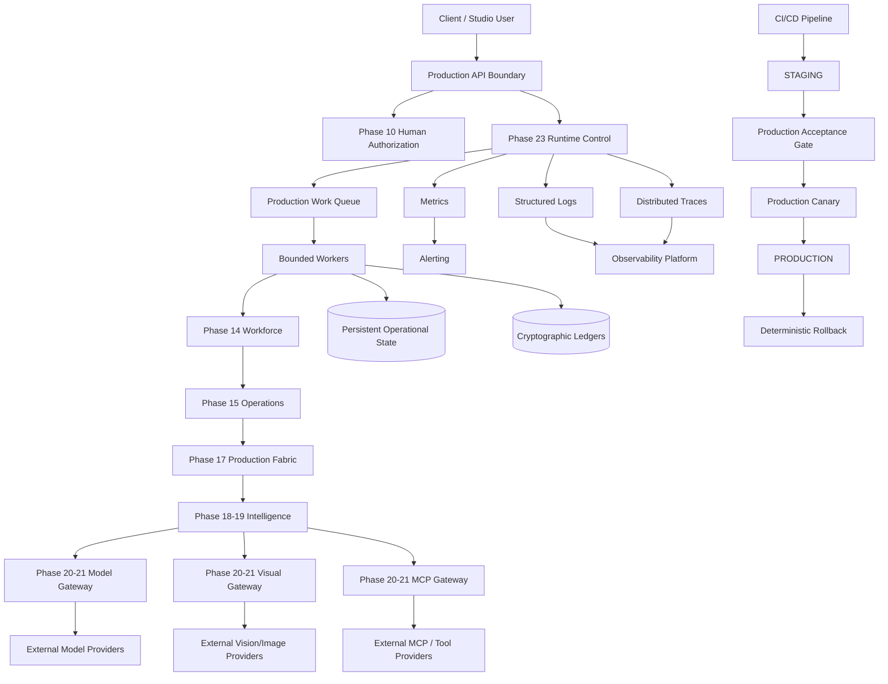

# PHASE 23 ENGINEERING DIRECTIVE
## ILYREN Creative Studio — Production Deployment, Live Operations & Reliability Boundary

**Status:** ENGINEERING INSTRUCTION — NOT YET IMPLEMENTED  
**Predecessor:** Phase 22 — Creative Studio Hardening & Production-Readiness Boundary

### Governing Invariant

\[
\mathbf{Intelligence \neq Authorization \neq Execution\ Authority \neq Security\ Policy}
\]

Additional mandatory invariants:

\[
\mathbf{Model\ Output \neq Truth \neq Permission}
\]

\[
\mathbf{External\ Tool\ Access \neq Blanket\ Access}
\]

\[
\mathbf{Learning \neq Security\ Policy\ Mutation}
\]

\[
\mathbf{Continuous\ Operation \neq Continuous\ Authorization}
\]

\[
\boxed{\mathbf{Production\ Reliability\ must\ increase\ capability\ without\ increasing\ authority}}
\]

---

# 1. Mission

Phase 23 converts the Phase 1–22 ILYREN substrate from a hardened and release-validated system into a **real, deployable, observable, recoverable, continuously operable production service**.

Phase 23 is not a new intelligence layer. It is the **operational infrastructure boundary** required to safely run the existing intelligence, workforce, production, model, visual, MCP, authorization, audit, and governance systems in real environments.

The objective is to prove that ILYREN can:

- start and stop safely;
- run in isolated environments;
- connect to real model and MCP providers;
- persist operational state;
- survive process and provider failures;
- recover interrupted workflows;
- preserve authorization state correctly;
- preserve audit lineage;
- expose health and telemetry;
- enforce cost and resource limits;
- deploy through controlled promotion;
- roll back deterministically;
- execute a controlled production canary;
- remain incapable of independently authorizing consequential external actions.

---

# 2. Current Verified Substrate

| Phase | Boundary |
|---|---|
| 1–13 | Governed intelligence, authorization, execution and external integration substrate |
| 14 | Creative Workforce & Organizational Intelligence |
| 15 | Studio Operations & Production Readiness |
| 16 | Client Experience & Studio Command Center |
| 17 | Production Fabric & Bounded Autonomy |
| 18 | Studio Intelligence & Closed-Loop Operations |
| 19 | Creative Intelligence Network & Institutional Intelligence |
| 20 | Provider-Neutral Model / Vision / MCP Architecture |
| 21 | Real Models, Real MCP, Visual Intelligence Benchmark |
| 22 | Hardening, Observability, Visual Evaluation & Deterministic Release Gates |

Phase 23 must build **around** these boundaries rather than creating competing control paths.

---

# 3. Non-Negotiable Governance Rules

## 3.1 Human Authorization Remains the Sole Execution Authority

No deployment service, worker, model, scheduler, retry mechanism, recovery process, MCP server, monitoring process, or autonomous controller may create execution authorization.

A restart must not turn an old approval into a new approval.

A retry must not create authorization.

A recovery operation must not create authorization.

A fallback provider must not inherit authority unless the existing authorization explicitly permits that capability and provider/environment combination.

## 3.2 Security Policy Is Immutable at Runtime

Operational configuration may change worker counts, queue priority, bounded timeout values, provider availability, resource budgets, and deployment versions.

Security policy may not be weakened through runtime configuration.

Prohibited examples:

- wildcard MCP access;
- `admin` capabilities;
- bypassing client isolation;
- disabling authorization checks;
- changing execution scopes;
- disabling audit logging;
- converting sandbox credentials into production credentials.

## 3.3 Recovery Is Not Re-Authorization

Every recovery path must distinguish:

```text
recover operational state
        !=
restore execution authority
```

If authorization is expired, invalid, consumed, revoked, or otherwise unusable, recovery must produce a blocked/handoff state.

## 3.4 Production Is Not a Test Environment

Production credentials, production databases, production provider endpoints, and production client data must never be reachable from TEST or SANDBOX processes.

The Phase 22 environment guard remains authoritative.

---

# 4. Target Architecture



---

# 5. Workstream A — Production Runtime Infrastructure

Create:

```text
src/production_runtime/
```

Recommended modules:

```text
exceptions.py
runtime_models.py
service_registry.py
process_manager.py
worker_manager.py
queue_runtime.py
startup.py
shutdown.py
runtime_state.py
dependency_health.py
runtime_orchestrator.py
__init__.py
```

Responsibilities:

- controlled startup;
- dependency verification;
- bounded worker lifecycle;
- queue initialization;
- graceful shutdown;
- runtime state persistence;
- crash-safe state reconstruction;
- dependency health evaluation.

Do not introduce a second authorization mechanism.

---

# 6. Workstream B — Persistent State & Recovery

Create:

```text
src/persistence/
```

Recommended modules:

```text
exceptions.py
storage_models.py
transaction.py
state_store.py
workflow_store.py
checkpoint_store.py
ledger_store.py
migration.py
backup.py
restore.py
integrity.py
__init__.py
```

Requirements:

- atomic writes;
- transactional boundaries;
- versioned schemas;
- idempotent recovery;
- integrity verification;
- corruption detection;
- backup metadata;
- deterministic restore;
- migration safety.

Keep separate:

```text
workflow state
authorization state
security policy
audit state
learning state
```

---

# 7. Workstream C — Secrets & Credential Operations

Create:

```text
src/secret_operations/
```

Recommended modules:

```text
exceptions.py
secret_models.py
secret_provider.py
credential_scope.py
rotation.py
lease.py
redaction.py
audit.py
__init__.py
```

Credential domains:

```text
LLM
Vision / Image Generation
MCP
Database
Storage
Notification
Observability
Deployment
```

Requirements:

- secrets must come from secure runtime injection or a secret-management mechanism;
- no secrets in source;
- no secrets in logs;
- credentials remain provider-scoped;
- credentials are never exposed to models;
- rotation does not require source changes;
- revoked credentials fail closed.

---

# 8. Workstream D — Deployment & Environment Management

Create:

```text
src/deployment/
```

Recommended modules:

```text
exceptions.py
deployment_models.py
environment_manifest.py
artifact_manifest.py
version_registry.py
promotion.py
canary.py
rollback.py
deployment_ledger.py
__init__.py
```

Environment progression:

```text
TEST
  ↓
SANDBOX
  ↓
STAGING
  ↓
PRODUCTION CANARY
  ↓
CONTROLLED PRODUCTION
```

Every promoted artifact must have:

- immutable version identifier;
- source revision;
- dependency lock;
- configuration fingerprint;
- benchmark evidence;
- security evidence;
- deployment metadata.

---

# 9. Workstream E — CI/CD

The deployment pipeline must execute at minimum:

```text
1. formatting/lint validation
2. static analysis
3. unit tests
4. integration tests
5. security tests
6. cross-phase regression tests
7. visual benchmark
8. model integration smoke tests
9. MCP integration smoke tests
10. cost-budget tests
11. artifact lineage validation
12. release gate
13. staging deployment
14. staging smoke test
15. canary gate
16. production promotion
```

No production pipeline may contain hidden bypasses such as:

```text
--skip-security
--force-production
--ignore-authorization
--disable-gate
```

---

# 10. Workstream F — Observability & Alerting

Required production telemetry:

### Runtime
- uptime;
- restart count;
- worker utilization;
- queue depth;
- queue age;
- failed jobs;
- recovery attempts.

### Model
- request count;
- p50/p90/p95/p99 latency;
- token usage;
- cost;
- provider errors;
- rate limits;
- fallback frequency.

### Visual
- generation latency;
- generation failures;
- artifact validation failures;
- visual regression;
- benchmark drift.

### MCP
- request count;
- tool-level latency;
- failures;
- rate limits;
- circuit state;
- denied capability requests.

### Governance
- approval requests;
- expired approvals;
- rejected authorization;
- blocked execution;
- replay attempts;
- cross-client violations;
- policy violations.

All telemetry must remain secret-free.

---

# 11. Workstream G — Cost & Resource Enforcement

Implement bounded budgets for:

```text
per-request
per-campaign
per-client
per-provider
per-day
per-cycle
```

Resource categories:

```text
LLM tokens
image generations
vision calls
MCP requests
storage
queue execution time
worker CPU/memory
external API requests
```

On budget exhaustion:

```text
BLOCK
→ RECORD
→ ALERT
→ HUMAN HANDOFF
```

Never silently increase a budget.

---

# 12. Workstream H — Failure Recovery

Implement deterministic recovery classes:

```text
MODEL_TIMEOUT
MODEL_RATE_LIMIT
MODEL_PROVIDER_FAILURE
VISION_TIMEOUT
VISION_PROVIDER_FAILURE
MCP_TIMEOUT
MCP_PROVIDER_FAILURE
MCP_CIRCUIT_OPEN
DATABASE_FAILURE
STORAGE_FAILURE
WORKER_CRASH
PROCESS_RESTART
STALE_APPROVAL
EXPIRED_APPROVAL
REVOKED_APPROVAL
CORRUPTED_STATE
BROKEN_LINEAGE
DEPLOYMENT_FAILURE
CANARY_FAILURE
```

For every class define:

```text
detect
classify
checkpoint
retry-or-stop
recover
verify
resume-or-escalate
audit
```

Recovery must be deterministic and idempotent.

---

# 13. Workstream I — Backup & Disaster Recovery

Implement and test:

- backup creation;
- restore;
- integrity verification;
- recovery-point definition;
- recovery-time definition;
- disaster simulation.

Preserve at minimum:

- client configuration;
- campaign state;
- workstream state;
- deliverable metadata;
- authorization references;
- workflow checkpoints;
- model routing configuration;
- provider configuration;
- audit ledgers;
- visual lineage;
- institutional intelligence metadata.

Sensitive credential material must not be embedded in ordinary backups.

---

# 14. Workstream J — Production Canary

The first production execution must be a controlled canary:

```text
Deploy
  ↓
Health verification
  ↓
Readiness verification
  ↓
Synthetic smoke test
  ↓
Read-only client workflow
  ↓
Model invocation
  ↓
Vision invocation
  ↓
MCP read operation
  ↓
Human-approved controlled mutation
  ↓
Outcome observation
  ↓
Ledger verification
  ↓
Canary evaluation
```

The first consequential external mutation must require explicit valid Phase 10 authorization.

---

# 15. Real Provider Validation

Validate the configured production pathway for:

## LLM
- request;
- structured output;
- timeout;
- rate limit;
- fallback;
- budget enforcement;
- redaction;
- ledger entry.

## Visual
- image generation;
- vision analysis;
- artifact validation;
- lineage recording;
- storage;
- retrieval.

## MCP
- server discovery;
- capability lookup;
- schema validation;
- request guard;
- result sanitization;
- credential boundary;
- rate limiting;
- circuit breaking;
- audit.

Provider credentials must never be exposed to the model workforce.

---

# 16. Recoverable Production State Machine

Minimum conceptual states:

```text
CREATED
ADMITTED
RUNNING
WAITING_FOR_APPROVAL
APPROVED
EXECUTING
OBSERVING
LEARNING
COMPLETED
FAILED
RECOVERING
BLOCKED
ESCALATED
CANCELLED
```

Invalid transitions fail closed.

Especially prohibited:

```text
WAITING_FOR_APPROVAL → EXECUTING
```

without valid authorization.

Also prohibited:

```text
FAILED → EXECUTING
```

without revalidation of the relevant execution boundary.

---

# 17. Authorization Recovery

On restart:

1. reconstruct workflow state;
2. reconstruct authorization references;
3. validate authorization freshness;
4. validate mission binding;
5. validate scope;
6. validate nonce/replay state;
7. validate client binding;
8. validate environment;
9. determine whether continuation is permissible.

If any condition fails:

```text
BLOCKED
→ HUMAN HANDOFF
```

Never:

```text
restart
→ assume previous authorization
→ execute
```

---

# 18. Multi-Tenant Production Isolation

Preserve client isolation across:

- memory;
- queues;
- workers;
- files;
- database records;
- visual assets;
- model context;
- MCP results;
- caches;
- logs;
- metrics;
- background jobs;
- recovery operations.

Every client-scoped task must carry immutable context:

```text
tenant_id
client_id
brand_id
campaign_id
mission_id
task_id
correlation_id
```

Cross-client context mixing must fail closed.

---

# 19. Phase 23 Security Threat Suite

Create:

```text
tests/phase23/
```

At minimum implement and verify:

| ID | Scenario | Expected result |
|---|---|---|
| T23-001 | Missing mandatory production secret | Fail closed |
| T23-002 | Sandbox attempts production DB access | Blocked |
| T23-003 | Wildcard MCP capability | Blocked |
| T23-004 | Expired approval used by worker | Blocked |
| T23-005 | Restart during authorized workflow | Recover state, then revalidate authorization |
| T23-006 | Restart after approval expiry | Blocked and escalated |
| T23-007 | Recovered duplicate mutation | Idempotency barrier blocks replay |
| T23-008 | Unlimited retry amplification | Bounded retry/circuit protection |
| T23-009 | Unauthorized fallback capability | Blocked |
| T23-010 | Credential appears in telemetry | Redacted/rejected |
| T23-011 | Plaintext secret in backup | Rejected |
| T23-012 | Corrupted checkpoint restore | Integrity failure/quarantine |
| T23-013 | Cross-client queue injection | Rejected |
| T23-014 | Runtime security-policy mutation | Rejected |
| T23-015 | Altered deployment dependency lock | Promotion blocked |
| T23-016 | Canary degradation | Automatic rollback |
| T23-017 | Audit logging disabled by config | Configuration rejected |
| T23-018 | Approval nonce replay | Rejected |
| T23-019 | Recovery of revoked authorization | Blocked |
| T23-020 | Model output contains execution command | Treated as untrusted data |
| T23-021 | MCP prompt injection | Sanitized/untrusted |
| T23-022 | Production budget exceeded | Execution blocked |
| T23-023 | Database failure during execution | Deterministic checkpoint/recovery |
| T23-024 | Ledger tampering | Integrity failure/quarantine |
| T23-025 | Release-gate bypass attempt | Deployment rejected |

---

# 20. Real Production Workflow Benchmark

Create:

```text
tests/phase23/test_phase23_real_workflow.py
```

Execute a controlled ILYREN/NOCAP workflow:

```text
1. client context
2. campaign creation
3. workforce assignment
4. creative direction
5. LLM strategy generation
6. visual generation
7. visual evaluation
8. independent review
9. approval request
10. human authorization
11. production admission
12. MCP/tool operation
13. controlled external mutation
14. outcome observation
15. intelligence evaluation
16. learning signal
17. checkpoint
18. simulated worker restart
19. state reconstruction
20. authorization revalidation
21. outcome reconciliation
22. ledger verification
23. cost verification
24. health verification
25. canary decision
```

The benchmark must demonstrate:

> **Operational continuity can be recovered without automatically recovering execution authority.**

---

# 21. Production Release Gates

| Gate | Requirement |
|---|---|
| G23-01 | Full test suite passes |
| G23-02 | Phase 23 threat suite passes |
| G23-03 | Cross-phase regression passes |
| G23-04 | Type/static analysis passes |
| G23-05 | No secret leakage |
| G23-06 | Environment isolation passes |
| G23-07 | Database migration validation passes |
| G23-08 | Backup/restore test passes |
| G23-09 | Model integration smoke test passes |
| G23-10 | Visual integration smoke test passes |
| G23-11 | MCP integration smoke test passes |
| G23-12 | Cost-budget controls pass |
| G23-13 | Ledger integrity passes |
| G23-14 | Visual benchmark remains within approved bounds |
| G23-15 | Canary health passes |
| G23-16 | Rollback test passes |
| G23-17 | Authorization boundary test passes |
| G23-18 | Production configuration audit passes |

Any failed gate means:

```text
NOT READY
```

No partial production promotion.

---

# 22. Documentation Deliverables

Create:

```text
docs/phase23/
├── PHASE-23-ARCHITECTURE.md
├── PHASE-23-PRODUCTION-DEPLOYMENT-PLAN.md
├── PHASE-23-RUNTIME-OPERATIONS.md
├── PHASE-23-SECRETS-AND-CREDENTIAL-REVIEW.md
├── PHASE-23-OBSERVABILITY-REPORT.md
├── PHASE-23-DISASTER-RECOVERY-PLAN.md
├── PHASE-23-SECURITY-REVIEW.md
├── PHASE-23-THREAT-MODEL.md
├── PHASE-23-REAL-WORKFLOW-REPORT.md
├── PHASE-23-TEST-REPORT.md
├── PHASE-23-COST-AND-RESOURCE-REPORT.md
├── PHASE-23-CANARY-REPORT.md
├── PHASE-23-ROLLBACK-REPORT.md
└── PHASE-23-GOVERNANCE-GATE.md
```

Also produce runbooks for:

```text
startup
shutdown
provider outage
MCP outage
database failure
credential rotation
rollback
restore
incident response
authorization failure
budget exhaustion
ledger integrity failure
```

---

# 23. Required Evidence

Do not report completion based only on source-code existence.

The final walkthrough must contain evidence for:

- exact deployment version;
- environment validation;
- test command and output;
- threat suite output;
- cross-phase regression output;
- real provider calls;
- visual generation;
- real MCP interaction;
- cost measurement;
- latency measurement;
- health/readiness output;
- backup creation;
- restore verification;
- simulated crash;
- state recovery;
- authorization revalidation;
- canary result;
- rollback test;
- ledger integrity verification.

Evidence must distinguish:

```text
IMPLEMENTED
TESTED
OBSERVED
VERIFIED
```

Do not use these terms interchangeably.

---

# 24. Acceptance Criteria

Phase 23 is complete only when all criteria are satisfied.

## Runtime
- [ ] Deterministic startup.
- [ ] Graceful shutdown.
- [ ] Dependency failure detection.
- [ ] Recoverable runtime state.
- [ ] Bounded workers.

## Security
- [ ] All Phase 1–22 boundaries remain intact.
- [ ] No new execution authority exists.
- [ ] No wildcard MCP access exists.
- [ ] Client isolation is preserved.
- [ ] Secrets remain outside model context.
- [ ] Telemetry remains secret-free.

## Models
- [ ] Real LLM pathway works.
- [ ] Real visual pathway works.
- [ ] Failures are bounded.
- [ ] Cost is measurable.
- [ ] Routing remains policy-bound.

## MCP
- [ ] Real MCP connectivity works.
- [ ] Capability allowlists remain exact.
- [ ] Results are sanitized.
- [ ] Rate limits work.
- [ ] Circuit breakers work.

## Persistence
- [ ] State survives restart.
- [ ] Corruption is detected.
- [ ] Backups complete.
- [ ] Restore succeeds.
- [ ] Ledgers remain verifiable.

## Deployment
- [ ] CI/CD pipeline is operational.
- [ ] Staging deployment succeeds.
- [ ] Canary deployment succeeds.
- [ ] Rollback succeeds.
- [ ] Production gate is deterministic.

## Authorization
- [ ] Valid approval permits only its declared scope.
- [ ] Expired approval blocks execution.
- [ ] Revoked approval blocks execution.
- [ ] Restart does not automatically re-authorize.
- [ ] Recovery does not create authority.
- [ ] Model output cannot authorize execution.

## Evidence
- [ ] Phase 23 threat suite passes.
- [ ] Cross-phase regression passes.
- [ ] Real workflow benchmark passes.
- [ ] Backup/restore evidence exists.
- [ ] Canary evidence exists.
- [ ] Rollback evidence exists.
- [ ] Governance documentation exists.

---

# 25. Explicit Non-Goals

Phase 23 must NOT:

- redesign the intelligence architecture;
- create a second authorization boundary;
- allow models to directly execute external actions;
- permit MCP wildcard access;
- expose credentials to model prompts;
- weaken client isolation;
- make security policy dynamically mutable;
- silently increase budgets;
- bypass release gates;
- treat telemetry as authoritative truth;
- treat model output as authorization;
- treat recovery as authorization;
- introduce unrestricted autonomous production execution.

---

# 26. Engineer Execution Order

Implement in this order:

```text
STEP 1
Inventory Phase 1–22 runtime dependencies.

STEP 2
Map every persistent state boundary.

STEP 3
Implement production runtime.

STEP 4
Implement persistence and checkpoints.

STEP 5
Implement secure credential operations.

STEP 6
Implement deployment manifests and environment promotion.

STEP 7
Implement CI/CD gates.

STEP 8
Integrate production observability.

STEP 9
Implement backup and restore.

STEP 10
Implement deterministic failure recovery.

STEP 11
Execute real model/vision/MCP staging validation.

STEP 12
Execute Phase 23 threat suite.

STEP 13
Execute cross-phase regression suite.

STEP 14
Execute restart/recovery real workflow.

STEP 15
Execute production canary.

STEP 16
Test deterministic rollback.

STEP 17
Collect all evidence.

STEP 18
Generate governance documentation.

STEP 19
Evaluate every Phase 23 release gate.

STEP 20
Only then issue the Phase 23 governance verdict.
```

---

# 27. Mandatory Final Governance Statement

The final Phase 23 governance document must contain this statement verbatim:

> **Phase 23 establishes the ILYREN Production Deployment, Live Operations & Reliability Boundary above the Phase 1–22 substrate. It converts the hardened ILYREN Creative Studio architecture into a continuously operable, observable, recoverable production service without creating new execution authority. Human authorization remains the sole source of execution authority; recovery does not imply re-authorization; model outputs and external observations remain untrusted until evaluated; security policy remains immutable; external provider access remains explicitly capability-bound; and every production deployment, recovery action, external mutation, and rollback remains auditable and reversible.**

\[
\boxed{
\mathbf{Production\ Reliability}
+
\mathbf{Real\ Operations}
+
\mathbf{Recovery}
+
\mathbf{Observability}
+
\mathbf{Human\ Authorization}
+
\mathbf{Security\ Invariance}
}
\]

\[
\boxed{
\mathbf{ILYREN\ can\ operate\ continuously\ in\ production\ without\ becoming\ independently\ authoritative}
}
\]

---

# 28. Final Engineer Rule

**Do not optimize for “deployment successful.”**

Optimize for:

> **“Deployment is successful, observable, recoverable, auditable, bounded, and incapable of silently acquiring authority.”**

A production system is not complete merely because it can execute.

It is complete when it can:

```text
RUN
OBSERVE
FAIL
RECOVER
RETRY SAFELY
STOP SAFELY
ROLL BACK
PROVE WHAT HAPPENED
AND REMAIN GOVERNED THROUGHOUT
```

**Phase 23 begins only after the engineer has read and understood this directive.**
