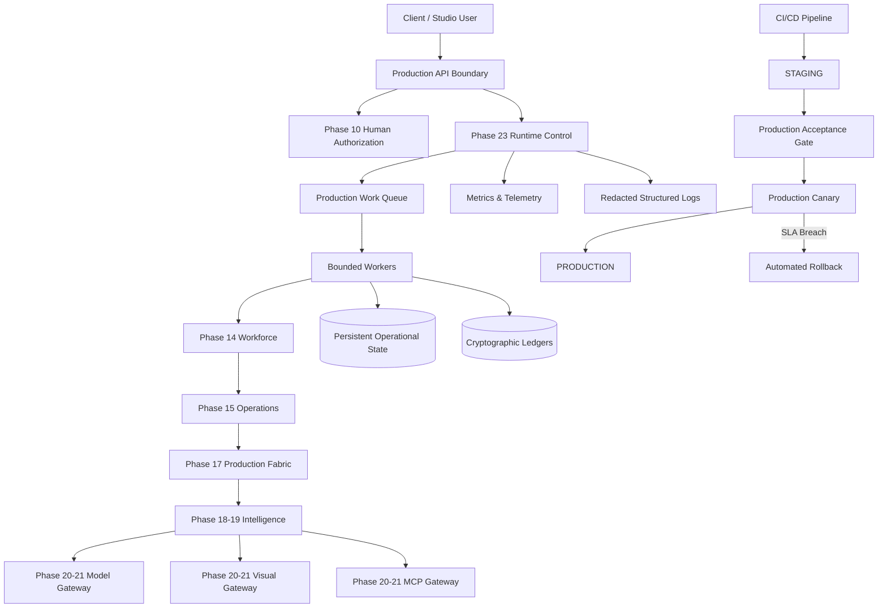

# Phase 23 Architecture & System Contracts
## ILYREN Creative Studio — Production Deployment, Live Operations & Reliability Boundary

### 1. Governing Invariant
$$\mathbf{Intelligence \neq Authorization \neq Execution\ Authority \neq Security\ Policy}$$

$$\boxed{\mathbf{Production\ Reliability\ must\ increase\ capability\ without\ increasing\ authority}}$$

---

### 2. Architecture Overview

Phase 23 operates above the hardened Phase 1–22 substrate, providing the operational and reliability boundary required for live continuous production operations.

---

### 3. Core Subsystems

1. **Production Runtime (`src/production_runtime/`)**:
   - `StartupCoordinator`: 5-stage verified deterministic boot.
   - `ShutdownCoordinator`: Two-phase graceful drainage (ingress cutoff -> in-flight drain).
   - `WorkerManager`: Bounded global workers with per-tenant concurrency quotas.
   - `ProductionQueueRuntime`: Async multi-tenant priority queue with Dead-Letter Queue (DLQ).
   - `RuntimeStateManager`: 14-state recoverable operational state machine.
   - `DependencyHealthMonitor`: Active non-blocking probes for critical infrastructure.

2. **Persistent State & Recovery (`src/persistence/`)**:
   - `StateStore`: Checksummed key-value store with Write-Ahead Log (WAL).
   - `CheckpointStore`: Step-level workflow snapshots with parent SHA-256 hash chaining.
   - `LedgerStore`: Cryptographic append-only operational event ledger.
   - `BackupGenerator` & `RestoreEngine`: Non-sensitive disaster recovery backups with schema validation.
   - `PersistenceIntegrityVerifier`: Automated audits for database and lineage integrity.

3. **Secret & Credential Operations (`src/secret_operations/`)**:
   - `ProductionSecretProvider`: Scoped runtime credential resolution.
   - `CredentialScopeValidator`: Least-privilege domain separation (LLM, VISION, MCP, DATABASE).
   - `SecretRotationEngine`: Zero-downtime credential rotation.
   - `SecretLeaseManager`: Time-bounded, auto-expiring credential leases.
   - `SecretRedactionEngine`: Ultra-fast regex and dictionary maskers preventing telemetry leaks.

4. **Deployment & Environment Management (`src/deployment/`)**:
   - `EnvironmentPromotionPipeline`: Stage progression (`TEST` -> `SANDBOX` -> `STAGING` -> `CANARY` -> `PRODUCTION`).
   - `ArtifactManifest` & `VersionRegistry`: Immutable cryptographic release fingerprints.
   - `CanaryController`: Real-time SLA monitoring with automated error budget protection.
   - `RollbackEngine`: Deterministic instant rollback to previous verified manifests.
   - `DeploymentLedger`: Immutable audit trail of deployment promotions and rollbacks.
